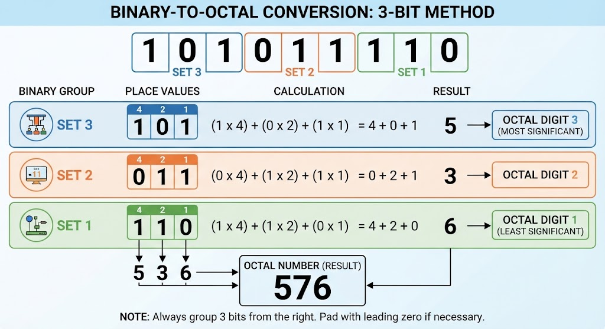

+++
title = "Linux Permissions Overview"
date = 2026-08-26

[taxonomies]
categories = ["Security"] 
tags = ["Linux", "Security"]
+++

## Why Learn Linux Permissions?

To the unwise, managing user permissions could be seen as a boring chore and be neglected. However, this will quickly grow into a dangerous vulnerability if left unmanaged, as user permissions serve as a core principle in the whole security architecture of your system!

This is why it's so important for security researchers, systems administrators, and casual day to day users of UNIX-like operating systems to learn how to manage user permissions and stay on top of their system's security.

## How to Check User Permissions?

In GNU/Linux systems, every file is assigned a permissions string which details which users can and cannot perform certain actions with the file.

The fastest way to check a file's permission is to simply use the "long list", `ls -l`
Using the `-l` flag with the `ls` utility gives you a lot of important information about your files, but today we focus on the very first string provided for each file in the long listing:

### Example

```
jacob@balamb-garden:~/Downloads> ls -l
total 23205896
-rw-r--r--. 1 jacob me 23588364288 Aug 21 18:34 blackarch-linux-full-2023.04.01-x86_64.iso
-rw-r--r--. 1 jacob me   165185536 Aug 25 20:23 claude-desktop_amd64.deb
-rw-r--r--. 1 jacob me     8388608 Jul 20 12:27 Fire Emblem - Genealogy of the Holy War (English).sfc
-rw-r--r--. 1 jacob me        8192 Jul 20 12:47 Fire Emblem - Genealogy of the Holy War (English).srm
drwxr-xr-x. 1 jacob me          90 Jul 20 12:18 Lil-Nordion 1.01
-rw-r--r--. 1 jacob me      878922 Jul 20 12:17 Lil-Nordion 1.01.zip
-rw-r--r--. 1 jacob me        4629 Jul 20 12:17 ReadMe 1.01.md
jacob@balamb-garden:~/Downloads> 
```
### Deciphering the Permissions String

The very first part of each line describing a file is the permissions string. Here is how to make sense of it:

#### First Character: To d or not to d

The very first character of the string will either be d for directory, or - if it's any other filetype that isn't a directory (so text files and binary files). 

#### Rest of the String: The *rwx* Trinity

The rest of the string shows 3 sets of repeating  *rwx* which stands for **read**, **write**, and **execute**, always in that order. The order is very important so that each permission has its own space, and can be treated as a binary switch. If the character is shown and not shown as a `-`, then that permission is active.

*The Three Sets*

You can see that there's three sets of rwx permissions:

1. **First set** - Owner's permissions, the permissions of the user who created the file.
2. **Second set** - Group permissions, you can assign a whole group of people permissions.
3. **Third set** - Others permissions, the permissions for everyone else.

The reason the order is so important is so that the computer has a simple binary number to understand user permissions by. For example, if all users have all permissions for a file and its permission string is `-rwxrwxrwx` then it can be represented by the binary number `111111111` as all permissions are enabled.

## Even Further Beyond: The Octal

Using some math, we can turn those 3 binary sets into a short, clean octal number.

Think of it like breaking down a nine-bit binary string into readable chunks. Because $2^3 = 8$, every group of **three binary bits** maps cleanly into a single **octal digit** ($0$ through $7$) using the **4-2-1 positional math** rule.

When you have a full permissions string in binary like `111111111` or a custom configuration, you don't have to parse it all at once. You just slice it into three independent sets of three, apply the weights, and sum them up.

As laid out in the breakdown above, taking a 9-bit string like `101011110` and splitting it from left to right gives you your three groups:

- **Set 1 (Left):** `101` evaluates to $4 + 0 + 1 = \mathbf{5}$
    
- **Set 2 (Middle):** `011` evaluates to $0 + 2 + 1 = \mathbf{3}$

- **Set 3 (Right):** `110` evaluates to $4 + 2 + 0 = \mathbf{6}$

Putting those digits together translates your raw binary sequence straight into the clean octal representation of **`536`**.

Please see the image below for a graphical depiction of this conversion.



## A Different Method: UGO

Different people have different learning styles, and if you struggle to learn the numerical representations of permissions in linux there is a different method for you.

If you're so inclined, look up *UGO Syntax* for permissions, it's an easier method to change user permissions with letters and mathematical operators like + or -.

However, due to the efficient and cerebral nature of representing permissions with the octal, it is obviously the gentleman's choice and I won't waste any more time explaining UGO on my blog.

## `chmod` ; Modifying Permissions

When you want to change the permissions on a file, it's as simple as quickly calculating the octal for the permissions you want to set and then using the `chmod` (Change Mode) utility like so:

`chmod 777 [filename]`

In that example, that just turned on all permissions for all users. Use your newfound powers wisely my friends.

## Default Permissions

Because of the default permissions linux gives new downloaded files, you may have to use `chmod` to give yourself execute permission manually.

## Changing Default Permissions with Masks

You can actually make the default permissions more restrictive for more security. It's done by setting the umask (unmask), a three digit decimal number that corresponds with the permission information. For example: `-022`

As you can see, it starts with a subtraction operator because it's showing how many bits to negate from the default permissions (in octal)

The default permissions for new directories is `777`, but with that `umask `active the default permissions for that directory would actually be `755` as the corresponding bits were negated.

The `umask` value is not universal to all users on the system, each user can set a personal default `umask` by editing their `/home/[username]/.bash_profile ` and setting a line `umask 022` or with whatever your desired default permissions mask would be, such as a `umask 027` for even tighter security.

## Special Permissions

### Temporary Root Permissions with SUID

In some cases, when executing files that need to access other files with stricter permissions, such as when accessing files that require root access, you can temporarily grant owner permissions that don't extend beyond the use of that file. 

This is done by adding the **SUID** bit, which is done by adding a 4 before the regular permissions octal. So a file with a new resulting permission of `644` is represented as `4644` when the **SUID** bit is set.

## Granting Root Group's Permissions with SGID

**SGID** also grants temporary elevated permissions, but it grants the permissions of the owner's group. This means that with the SGID bit set, someone without execute permissions can execute the file if the owner's group has execute permissions.

The **SGID** bit is represented as a 2 before the regular permissions octal, so a file with new permissions of `644` would be represented as `2644` with  the SGID bit set.

When applied to directories, the **SGID** bit works differently. All files created in that new directory will be owned by the creator's group. This is useful when sharing a directory with multiple users, as all users in the group will be able to execute the files.

## Privilege Escalation; Why Permission Management Matters

These special permissions are useful but are a vector for vulnerabilities. If poorly managed, threat actors could exploit files with the SUID or SGID bit set and temporarily get root privileges and carry out an attack.

With careful and thoughtful permission architecture however, these vulnerabilities can be avoided.
