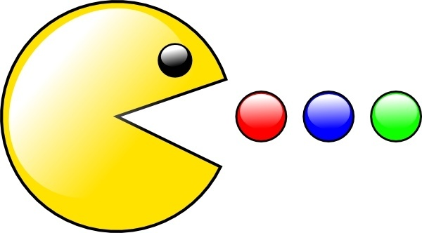

+++
title = "Pacman Package Management"
date = 2026-08-23

[taxonomies]
categories = ["Software"]
tags = ["Linux", "Arch Linux", "Software Management", "Systems Administration"]
+++

## Managing Software on GNU/Linux

Managing software on any system is a key discipline to maintaining its integrity, as relying on abstractions from the hardware is very useful but comes with costs such as version control, code maintenance and other disciplines. 

If you have a rolling release such as archlinux, where new packages are available for update as soon as they get developed and published, this is doubly important as maintaining a rolling release is like sharpening a blade; you always want to keep your software and libraries sharp and up to date to avoid version misalignment and dependency disasters.

This is why for this article, I want to focus specifically on archlinux and its package manager `pacman` as of out of my two daily driven operating systems (openSUSE and archlinux), it's more at risk of accidents in package management due to tumbleweeds automated safety features.

## The Anatomy of the Pacman

Instead of using a syntax of English words like `apt` or `zypper`, `pacman` uses a rigid system of **flags**. Every action you'll do with `pacman` begins with a **master_flag** followed by a **sub flag**.

Because of the widespread use of Debian based systems, and the intuitive syntax of apt, I will include equivalents to apt in the table below.

| **Action** | **Master Flag** | **Purpose**                                                        | **Equivalent in apt**       |
| ---------- | --------------- | ------------------------------------------------------------------ | --------------------------- |
| **Sync**   | `-S`            | Interact with the remote repositories (Install, update, download). | `apt install`, `apt update` |
| **Query**  | `-Q`            | Interrogate the local system database.                             | `dpkg -l`, `apt list`       |
| **Remove** | `-R`            | Sever a package from the system.                                   | `apt remove`, `apt purge`   |

### Sync

This is how you reach out to interact with remote mirrors, the servers distributing software for your linux distribution.

- `pacman -S [package]` Installs a package.
- `pacman -Ss [string]` Searches the repositories for a keyword.
- `pacman -Si [package]` Displays exhaustive technical details about a package before you decide to install it.

#### The Great Update

`pacman -Syu`

That command right there is the holy grail to archlinux. It's a `pacman` sync command, which means it connects to the remote mirrors. The `y` flag tells your system to compare it's local database to the remote repository. The `u` flag tells the system to then update any applicable out of date software.

Using this command regularly is the key to managing the rolling nature of archlinux and keeping your system safe and maintained.

### Query

This is how you assess your own domain; your local machines internal database. This is critical for forensics and system administration.

- `pacman -Qe` **Analysis:** Lists explicitly installed packages. These are the packages you installed on purpose, not counting any background dependencies.
- `pacman -Qdt` **The Ghost Hunt:** Lists "orphans"; dependencies that were pulled in for a package you have since deleted. They are dead weight, draining resources.
- `pacman -Qo /path/to/file` **The Interrogation:** If you find a strange binary or configuration file on your system and want to know where it came from, this command forces the system to reveal which package owns that exact file.

### Remove

Amateurs use `pacman -R [package]`, but it's a sloppy kill. It removes the target package but it leaves behind all of it's dependencies on the system, cluttering your storage with orphaned libraries and now useless configuration files.

If you want to leave no trace, behold the master's strike:

`sudo pacman -Rns [package]`

- `R` **(Remove)**: Target the package.
- `n` **(No Save)**: Annihilate the global configuration files for that package, doesn't leave a `.pacsave` backup behind.
- `s` **(Recursive)**: Hunts down and removes every dependency that was only tied to this target and is no longer needed. To nuke them all would be to use the subflag `c` (Cascade) instead, but this is dangerous business.

## Maintaining the Cache

Every time `pacman` installs or upgrades a package, it keeps the compressed `.tar.zst` file in `/var/cache/pacman/pkg/`. Over many moons of usage, this cache will grow to massive proportions, silently and insidiously hoarding storage space on your disk.

You must routinely strike the cache down, but it is good practice to keep the last three versions of a package in case you ever need to downgrade to fix some software version misalignments.

`sudo paccache -r` will do this automatically for you.
## Closing Thoughts

There's no better practice than directly working with the tool yourself, but if you find yourself unable to tinker with `pacman` at the moment, please see the interactive `pacman` command building sandbox I made below!

---

  <h3>Pacman Syntax Forge</h3>
  
  

    <h4>1. Master Stance</h4>
    

      <label class="forge-radio"><input type="radio" name="master_flag" value="sync" checked> Sync (-S)</label>
      <label class="forge-radio"><input type="radio" name="master_flag" value="query"> Query (-Q)</label>
      <label class="forge-radio"><input type="radio" name="master_flag" value="remove"> Remove (-R)</label>
    

  

  

    <h4>2. Sub-Flags</h4>
    

      <!-- Checkboxes injected by JS -->
    

  

  

    <h4>3. Target (Optional)</h4>
    <input type="text" id="forge-target" placeholder="package_name or /path/to/file" class="forge-input" autocomplete="off" spellcheck="false">
  

  

    
sudo pacman -S

    

  




