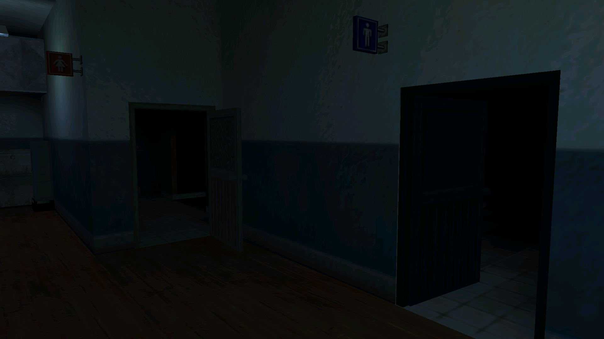
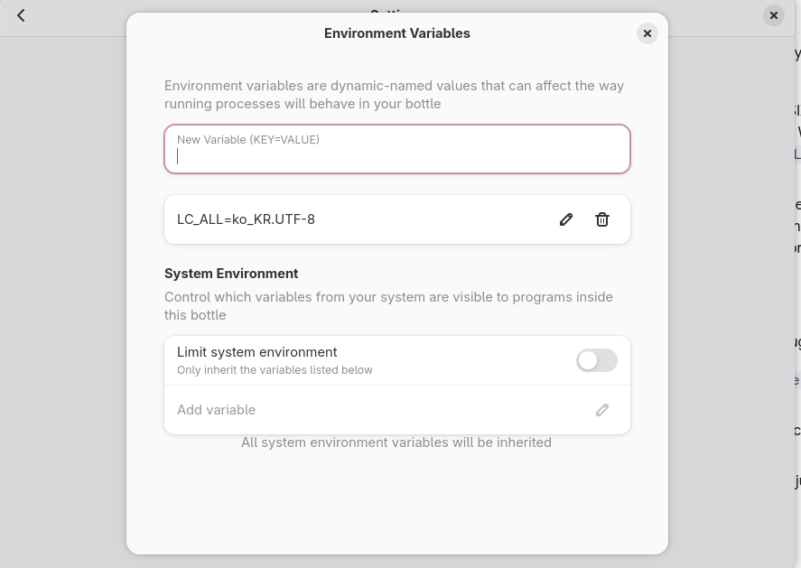
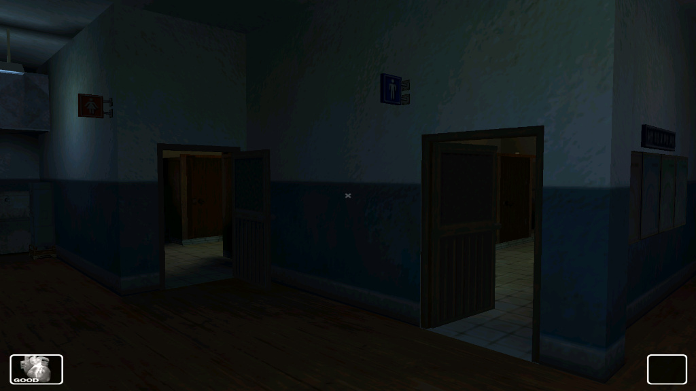

+++
title = "Spirits in the System; Text Encoding & Locales"
date = 2026-09-13

[taxonomies]
categories = ["Architecture"] 
tags = ["Architecture", "Linux", "Windows", "Emulation", "Low Level"]
+++

## White Day: A 2001 South Korean Horror Game

I've heard good things about this game, and as I love old underrated and nearly forgotten games I had to try it for myself. At first I thought it would be simple; a routine install of the executable windows installer using bottles and wine (a windows compatibility layer suite) on my archlinux computer and I could get right into the game! But no... The spectral memory of the Sonnori devs had to come back and haunt me, before I could even experience the real ghosts in their game!

### Forgotten UI and Flying Doorknobs

At first when I launched the game in my bottle, everything seemed fine. The cutscenes were crisp, the movement worked fine and as I never played the game before everything seemed fine. 

My luck quickly ran out however, as when I turned the corner out of the main hall, I could tell the game was already bonked. As you can clearly see, this doorknob texture was out of place creating a look one might consider too haunted. Not to mention, the bathrooms were completely pitch black so you couldn't find the game crucial notebook and pen which is the game's save mechanic.

However, the heartbreaking, game killing issue was the absolute lack of access to your inventory, your phone, and the school map. You absolutely cannot progress with these issues, so to fix this we have to look deeper.

## The Crux of the Problem; Locales & Text Encoding

### What is Text Encoding?

Once a program is compiled, the computer doesn't care about text. A computers world is one of numbers, and although we stand on giant shoulders and titanic abstractions, at the end of the day our text we write and read is converted into binary numbers for our faithful CPU's to crunch through.

If every character in text is translated to a letter, then we need numbers for all of them. And because there are so many ways of writing human languages, we need multiple ways of encoding text to binary numbers. This is text encoding.

#### ASCII

At first, there was ASCII. During a time when computing was dominated by people who wrote with Latin characters, it made sense to make a relatively small character set comprising of the Roman alphabet, some math and grammar characters, and some non printable instruction characters.

This was done by using 1 byte to store information, with the first bit being a placeholder 0. However this small amount of space made it impossible to represent the writing of other languages, such as Asian languages with their vast amount of unique characters and relatively complex scripts. However even in the early days before global unicode incorporation, regional developers had clever ways to work around this.

To understand the next topic, we need to understand that because ASCII used the last 7 bits of the byte, there were 128 slots (0-127) or possible characters that could be represented. Because a byte holds 256 values, developers were able to use the upper slots (128-255) to represent their own languages characters

#### Code Pages

Different regions started making maps to make use of these unused upper slots in the byte, and they called them **Code Pages**. 

- A North American PC used CP1252, where the memory value 0xE9 meant 'é'.

- A Russian PC used CP1251, where that exact same 0xE9 value meant 'щ'.

- Asian systems used Multi-Byte Character Sets like CP949, pairing bytes together to handle thousands of characters.

Since I opened a Korean file on an English OS, the computer blindly read the binary through the wrong map, crashing the legacy *White Day* hooks. The C++ read Korean bytes but tried to draw them using the English code page.

#### Unicode, The Master Index

To put an end to the textual mismatches, the world came together and created Unicode. While not being an encoding itself, it's a massive theoretical database that assigns a unique ID to every character, symbol, and emoji on Earth. 'A' is always U+0041, and the kanji 水 is always U+6C34.

Unfortunately for White Day and the Sonnori devs, widespread Unicode adoption was still years away in 2001, leaving them entirely dependent on regional code pages like CP949.

#### UTF-8

Systems still need a way to store those massive Unicode ID's in memory without breaking legacy software, so UTF-8 is used as an encoding algorithm that translates Unicode points into actual binary.

- English characters still only take 1 byte, meaning it's backwards compatible with ASCII

- Complex characters like hangul or emojis expand to take 2, 3 or even 4 bytes of memory when necessary.

### Drifting Memory

- The Byte-Pointer Shift: In CP949, a single Hangul character occupies 2 contiguous bytes. Under CP1252, the game's file parser reads those 2 bytes as two completely separate ASCII characters.

- Cascading Offset: When the engine parses map files or script data containing Korean comments or asset paths, every Hangul character causes the internal read pointer to drift.

- Corrupted Coordinates: When the engine reaches the binary block expecting 4-byte floating-point numbers (X, Y, Z spatial coordinates), the pointer is misaligned by a byte or two. It reads raw, adjacent garbage data as position numbers; launching doorknobs into mid air and causing lightmap path requests to fail in the bathrooms.

### What is a Linux Locale?

A linux locale is a set of environment rules specific in `glibc` (GNU C Library) denoting language, character set mappings, and regional formatting.

Running `locale-gen` compiles the definitions uncommented in `/etc/locale.gen` directly into a binary archive stored at `/usr/lib/locale/locale-archive`

Linux uses seperate locale variables for various tasks, but `LC_ALL` is the POSIX master override that forces every sub category to adopt a single locale definition.

So, to run applications hardcoded for Korean operating systems, you need to uncomment the Korean locales in your `/etc/locale.gen` and then use the `locale-gen` utility.

### Setting the LC_ALL Environment Variable in the Bottle

Once you have added the Korean locales to your system, all you need to do now is navigate to the bottle settings in your bottle, navigate to environment variables and then set the LC_ALL environment variable as in this image below to override the bottle with the Korean locale.

## Relief & Closing Thoughts

The override works, and now we can see a schoolhall that obeys the laws of physics as well as illuminated bathrooms, topping it all off with a functional UI.

It's amazing how much you can learn about low level systems architecture from troubleshooting old abandonware! I hope you learned something from this experience as well.
